# 👨‍💻 Karim M. Shlal
### AI & ML Engineer | MSc in Artificial Intelligence | Systems Architect

<div align="center">
  


</div>

---

## 🎯 About Me

```python
class KarimShlal:
    def __init__(self):
        self.name = "Karim M. Shlal"
        self.role = "AI & ML Engineer"
        self.education = "MSc in Artificial Intelligence"
        self.specialties = ["Machine Learning", "Deep Learning", "System Architecture"]
        self.passions = ["AI Innovation", "Problem Solving", "Technology Leadership"]
        self.current_focus = "Building next-gen intelligent systems"
        
    def get_daily_routine(self):
        return [
            "☕ Start with coffee and AI research papers",
            "🧠 Design & train ML models", 
            "💻 Code intelligent solutions",
            "🚀 Deploy scalable systems",
            "📚 Learn something new"
        ]
```

---

## 🛠️ Tech Arsenal

<div align="center">

### 🤖 AI & Machine Learning


### 💻 Development & Systems


### ☁️ Cloud & DevOps


### 🗄️ Databases


</div>

---

## 📊 GitHub Analytics

<div align="center">
  
  
</div>

<div align="center">
  
</div>

---

## 🚀 Featured Projects & Expertise

<div align="center">

| 🤖 AI/ML Projects | 🌐 Full-Stack Development | ☁️ Cloud Architecture | 📊 Data Science |
|-------------------|---------------------------|----------------------|------------------|
| Neural Networks & Deep Learning | React + Node.js Applications | Kubernetes Orchestration | Advanced Analytics |
| Computer Vision Systems | RESTful API Development | CI/CD Pipelines | Data Visualization |
| NLP & Text Processing | Modern Web Frameworks | Microservices Architecture | Statistical Modeling |
| Predictive Analytics | Database Design & Optimization | Auto-scaling Solutions | Big Data Processing |

</div>

---

## 🌟 Current Focus

```mermaid
graph LR
    A[🎯 AI Research] --> B[🔬 Experimentation]
    B --> C[🚀 Implementation]
    C --> D[📈 Optimization]
    D --> E[🌍 Real-world Impact]
    E --> A
```

<div align="center">



**Building the next generation of intelligent systems that make a difference**

</div>

---

## 📫 Let's Connect!

<div align="center">

[
[
[](https://yourportfolio.com)
[](mailto:shlalkarim.com)

**💡 "Innovation distinguishes between a leader and a follower" - Steve Jobs**

</div>

---

<div align="center">
  
  
  **🚀 Always innovating, always learning, always building the future! 🚀**
</div>
